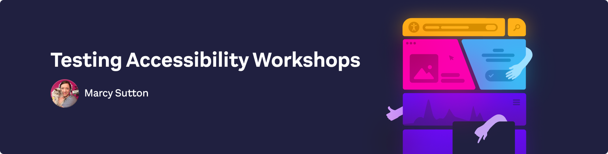

  <h1 align="center">✨ Testing Accessibility with Marcy Sutton ✨</h1>

  
  
  <h2>
    Resources for building accessible web applications with HTML, CSS, JavaScript, and React
  </h2>

  

    Ensuring your frontend code is accessible requires consistent development effort and testing of inclusive markup and scripted interactions. In these workshops we’ll build
    accessible web pages using widely supported and proven tools and
    techniques. We’ll cover everything about building accessible frontend
    applications, from the absolute basics with HTML and CSS to the tricky parts you’ll run into building and testing JavaScript-heavy components.
  

  
In this repo, you’ll find resources for all of the Testing Accessibility workshops. It is meant to be a companion to the workshop repos found in this same GitHub org: <a href="https://github.com/testing-accessibility">https://github.com/testing-accessibility</a>

